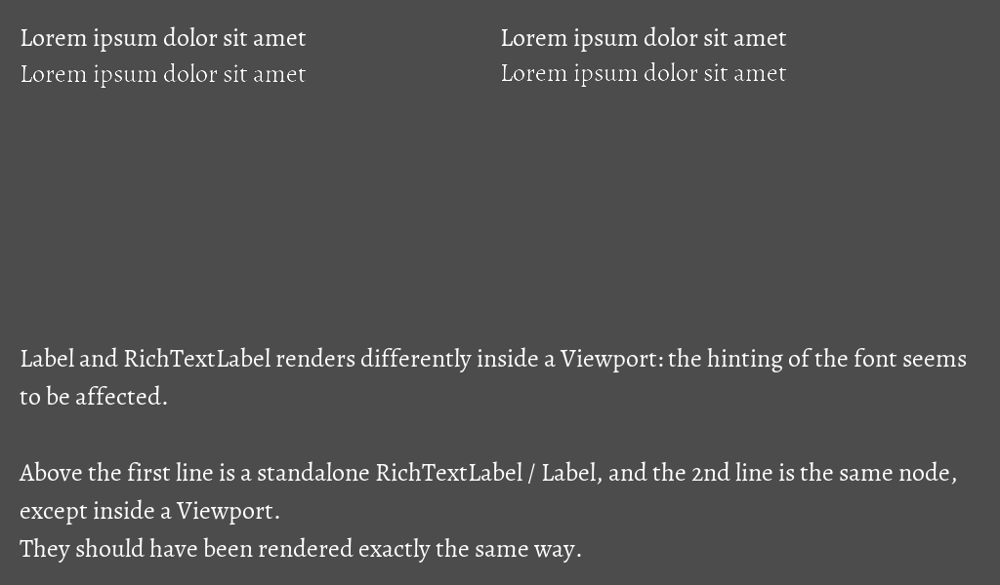

# Label and RichTextLabel renders differently in Viewports

This is a standalone project made with Godot v3.5.1.stable.official to demonstrate a bug affecting Label and RichTextLabel nodes inside a Viewport.

